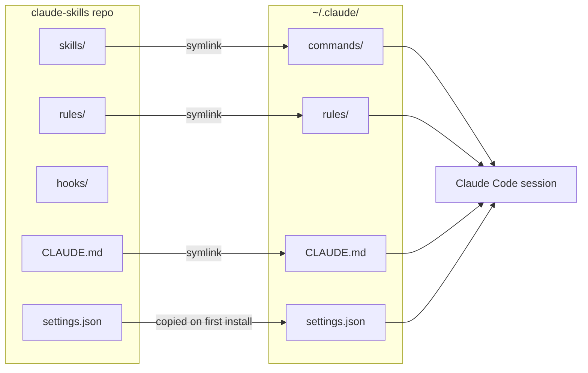

# claude-skills

## Table of Contents

- [Synopsis](#synopsis)
- [Repo Structure](#repo-structure)
- [Installation](#installation)
- [Claude Code Extension Points](#claude-code-extension-points)
  - [Skills — Slash Commands](#1-skills--slash-commands)
  - [Hooks — Event-Driven Automation](#2-hooks--event-driven-automation)
  - [CLAUDE.md and Rules — Persistent Instructions](#3-claudemd-and-rules--persistent-instructions)
  - [settings.json — Permissions, Env, Model](#4-settingsjson--permissions-env-model)
  - [MCP Servers — Custom Tools](#5-mcp-servers--custom-tools)
- [Skills Reference](#skills-reference)
- [Maintenance](#maintenance)

---

## Synopsis

A version-controlled collection of Claude Code configuration: slash commands, hooks, persistent instructions, and settings — all managed from one repo and deployed to `~/.claude/` via `install.sh`.



---

## Repo Structure

```
claude-skills/
├── skills/          # Slash commands (/commit, /push, /review, etc.)
├── hooks/           # Shell scripts called at lifecycle events
├── rules/           # Scoped instruction fragments (loaded by CLAUDE.md rules system)
├── CLAUDE.md        # Global instructions loaded into every session
├── settings.json    # Hook wiring, permissions, env vars, model config
└── install.sh       # Deploy everything to ~/.claude/
```

---

## Installation

**Prerequisites:** Git, Bash, [Claude Code](https://claude.ai/code) CLI installed.

```bash
git clone git@github.com:archdukejim/claude-skills.git ~/claude-skills
cd ~/claude-skills
./install.sh
```

The installer:
1. Symlinks `~/.claude/commands` → `skills/` (migrates any existing commands first)
2. Symlinks `~/.claude/rules` → `rules/`
3. Symlinks `~/.claude/CLAUDE.md` → `CLAUDE.md`
4. Copies `settings.json` to `~/.claude/settings.json` if none exists

**Uninstall:**
```bash
./install.sh --uninstall
```
Removes all symlinks created by this repo. Skips anything pointing elsewhere.

**Verify:**
```bash
ls -la ~/.claude/commands ~/.claude/rules ~/.claude/CLAUDE.md
```

---

## Claude Code Extension Points

### 1. Skills — Slash Commands

**What:** Plain Markdown files in `skills/` that become `/command` shortcuts in any Claude Code session. Each file has YAML frontmatter declaring allowed tools and a description.

**Location:** `skills/*.md` → symlinked to `~/.claude/commands/`

**Format:**
```markdown
---
description: "One-line description"
allowed-tools: ["Bash(git log:*)", "Read", "Write"]
---

Instructions for Claude to follow when this skill is invoked.
```

**Usage:** Type `/skillname` in any Claude Code session. Changes take effect immediately — no restart needed.

---

### 2. Hooks — Event-Driven Automation

**What:** Shell scripts that run automatically at Claude Code lifecycle events. Hooks are *enforced* — they can block actions, inject context, or post-process results. They run deterministically, separate from Claude's judgment.

**Location:** Scripts in `hooks/`, wired up in `settings.json`

**Hook events:**

| Event | When it fires | Common use |
|---|---|---|
| `UserPromptSubmit` | Before every prompt | Inject dynamic context |
| `PreToolUse` | Before any tool runs | Block unsafe commands |
| `PostToolUse` | After any tool runs | Auto-format, lint, log |
| `Stop` | Claude finishes responding | Notifications, cleanup |
| `SessionStart` | Session opens / after compaction | Re-inject critical context |
| `Notification` | Claude waiting for input | Desktop alerts |
| `CwdChanged` | Working directory changes | Reload env vars |
| `FileChanged` | Watched file changes on disk | Reload `.env`, `.envrc` |

**Hook exit codes:**
- `0` — allow; stdout is injected as context
- `2` — block; stderr message is shown to Claude
- other — log error, action proceeds

**Hook types** (set in `settings.json`):
- `"type": "command"` — shell command (most common)
- `"type": "prompt"` — single-turn LLM evaluation
- `"type": "agent"` — multi-turn subagent with tools
- `"type": "http"` — POST to external endpoint

**Wiring example in `settings.json`:**
```json
"PostToolUse": [
  {
    "matcher": "Edit|Write",
    "hooks": [
      { "type": "command", "command": "/path/to/hooks/format.sh" }
    ]
  }
]
```

See `hooks/README.md` for full details.

---

### 3. CLAUDE.md and Rules — Persistent Instructions

**What:** Markdown loaded into every Claude Code session as standing instructions. Two layers:
- `CLAUDE.md` — global rules for all projects
- `rules/*.md` — topic-scoped rules, optionally restricted to specific file paths

**Locations:**
- `~/.claude/CLAUDE.md` (symlinked from this repo) — loaded for every session, every project
- `~/.claude/rules/*.md` (symlinked from this repo) — loaded based on frontmatter `paths` matchers
- `./CLAUDE.md` — project-local rules (not managed by this repo; add per-project)

**Rules file format:**
```markdown
---
description: What this rule covers
paths: ["src/**/*.ts", "*.go"]   # optional: scope to matching files
---

Rule content here.
```

**Imports:** Reference other files in `CLAUDE.md` with `@path/to/file`.

This repo includes:
- `rules/code-quality.md` — naming, complexity, duplication standards
- `rules/security.md` — injection, secrets, validation rules

---

### 4. settings.json — Permissions, Env, Model

**What:** Controls hook wiring, allowed/denied tools, environment variables passed to tools, model selection, and sandbox configuration.

**Location:** `settings.json` in this repo → copied to `~/.claude/settings.json` on first install

**Key sections:**
```json
{
  "hooks": { ... },          // event → matcher → hook scripts
  "permissions": {
    "allow": [],             // always-allow tool patterns
    "deny": []               // always-deny tool patterns
  },
  "env": {},                 // env vars injected into tool execution
  "model": "claude-opus-4-6" // override default model
}
```

**Note:** After first install, `settings.json` is an independent copy at `~/.claude/settings.json`. Edit it directly for machine-specific settings. To propagate repo changes, merge manually or re-run the installer after deleting the file.

---

### 5. MCP Servers — Custom Tools

**What:** Declare external tools (cloud APIs, local scripts) that appear as callable tools in Claude's tool list. Not managed by this repo yet — add when needed.

**Location:** `~/.claude/mcp.json` (user-wide) or `.claude/mcp.json` (project-level)

**Format:**
```json
{
  "mcpServers": {
    "my-tool": {
      "type": "stdio",
      "command": "python3",
      "args": ["/path/to/server.py"],
      "env": { "API_KEY": "${MY_API_KEY}" }
    }
  }
}
```

To add MCP support to this repo: create `mcp.json` and add an install step to `install.sh`.

---

## Skills Reference

| Command | Description |
|---|---|
| `/commit` | Stage changed files and create a Conventional Commit message |
| `/push` | Update README → commit → push, then suggest next steps |
| `/readme` | Generate or update README.md with version stamp and gap analysis |
| `/review` | Review recently changed code for bugs, security issues, and style |
| `/test` | Find and run tests scoped to recently changed functions |
| `/diagram` | Generate a Mermaid architecture or sequence diagram |
| `/adr` | Create an Architecture Decision Record |
| `/refactor` | Analyze and apply targeted refactors to a file or function |
| `/incident` | Root cause analysis and postmortem draft for a production issue |
| `/spec` | Turn a feature description into a structured technical spec |

**README version tracking:** `/readme` and `/push` stamp `README.md` with the current commit hash:
```html
<!-- readme-version: abc1234 -->
```
On subsequent runs they diff from that hash and rewrite only affected sections.

---

## Maintenance

**Adding a skill:** Create `skills/<name>.md`. Available immediately as `/<name>`.

**Adding a rule:** Create `rules/<name>.md` with optional `paths` frontmatter. Symlinked automatically.

**Adding a hook:** Add a script to `hooks/`, wire it in `~/.claude/settings.json`.

**Updating CLAUDE.md:** Edit `CLAUDE.md` in the repo. The symlink means changes are live instantly.

**Syncing to a new machine:**
```bash
git clone git@github.com:archdukejim/claude-skills.git ~/claude-skills
cd ~/claude-skills
./install.sh
```

---

<!-- readme-version: d70d828686bbd1a14b4e0042df23ace795bfafb2 -->
