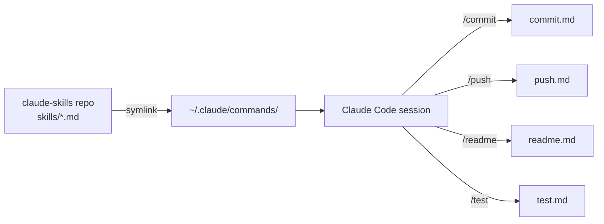

# claude-skills

## Table of Contents

- [Synopsis](#synopsis)
- [Installation](#installation)
- [Operations](#operations)
- [Maintenance](#maintenance)

---

## Synopsis

A version-controlled collection of Claude Code slash commands (skills). The `skills/` directory is symlinked to `~/.claude/commands/`, making every `.md` file in the repo instantly available as a `/command` inside any Claude Code session. Skills are plain Markdown files with a YAML frontmatter header that declares allowed tools and a description.



---

## Installation

**Prerequisites:** Git, Bash, [Claude Code](https://claude.ai/code) CLI installed.

```bash
git clone <repo-url> ~/claude-skills
cd ~/claude-skills
./install.sh
```

The installer:
1. Creates `skills/` in the repo if absent.
2. If `~/.claude/commands` is an existing directory, migrates its files into `skills/` then removes it.
3. Creates a symlink: `~/.claude/commands` → `<repo>/skills/`.
4. Errors cleanly if a conflicting symlink already exists.

To verify:
```bash
ls -la ~/.claude/commands   # should show -> /path/to/claude-skills/skills
```

---

## Operations

Skills are invoked inside Claude Code with a leading `/`:

| Command | Description |
|---|---|
| `/commit` | Stage changed files and create a Conventional Commit message |
| `/push` | Update README → commit → push, then suggest next steps |
| `/readme` | Generate or update README.md with version stamp and gap analysis |
| `/test` | Find and run tests scoped to recently changed functions |

**Adding a skill:**

Create a `.md` file in `skills/` with this structure:

```markdown
---
description: "One-line description shown in the /help list"
allowed-tools: ["Bash(git log:*)", "Read", "Write"]
---

Instructions for Claude to follow when this skill is invoked.
```

The file is immediately available as `/<filename>` in any Claude Code session — no restart needed.

**README version tracking:**

`/readme` and `/push` stamp the bottom of `README.md` with the current commit hash:
```html
<!-- readme-version: abc1234 -->
```
On subsequent runs they diff from that hash so only changed sections are rewritten.

---

## Maintenance

**Updating skills:** Edit `.md` files in `skills/` directly — changes take effect immediately.

**Re-running the installer:** Safe to run again; it detects the existing symlink and exits cleanly.

**Removing a skill:** Delete its `.md` file from `skills/`. The command disappears from Claude Code on next session.

**Syncing to a new machine:**
```bash
git clone <repo-url> ~/claude-skills
cd ~/claude-skills
./install.sh
```

---

<!-- readme-version: eee984fdeeb8410fb5f32254e78db02608ea7f21 -->
